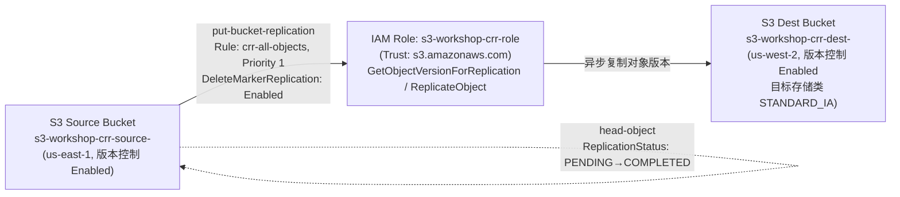
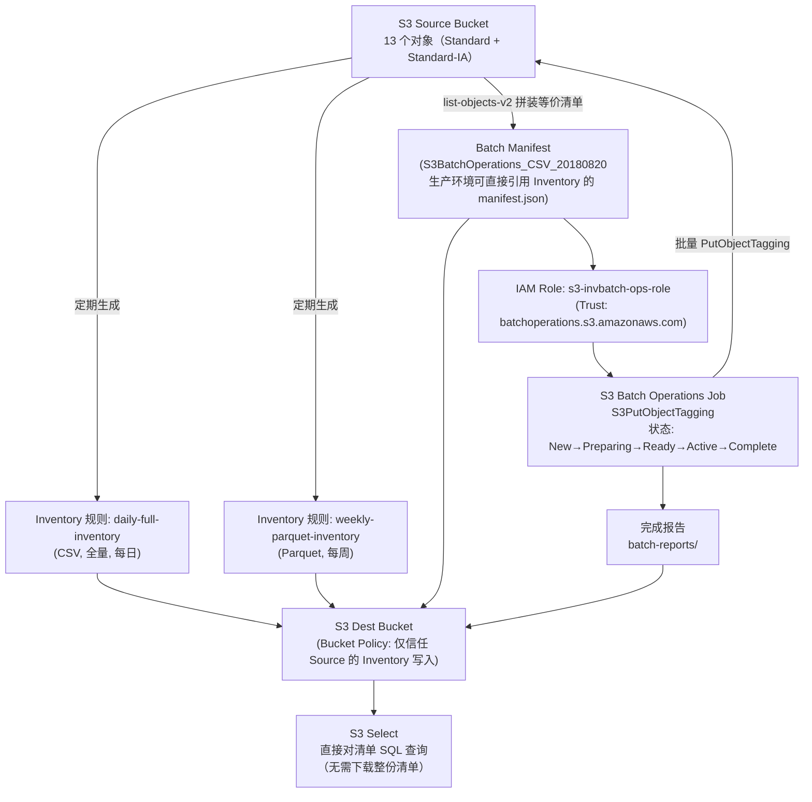
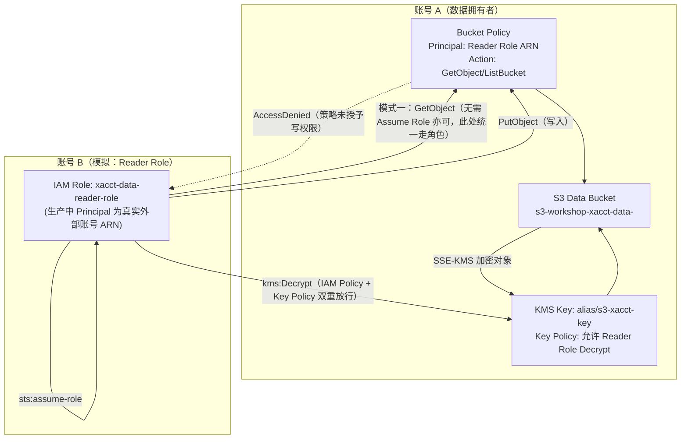
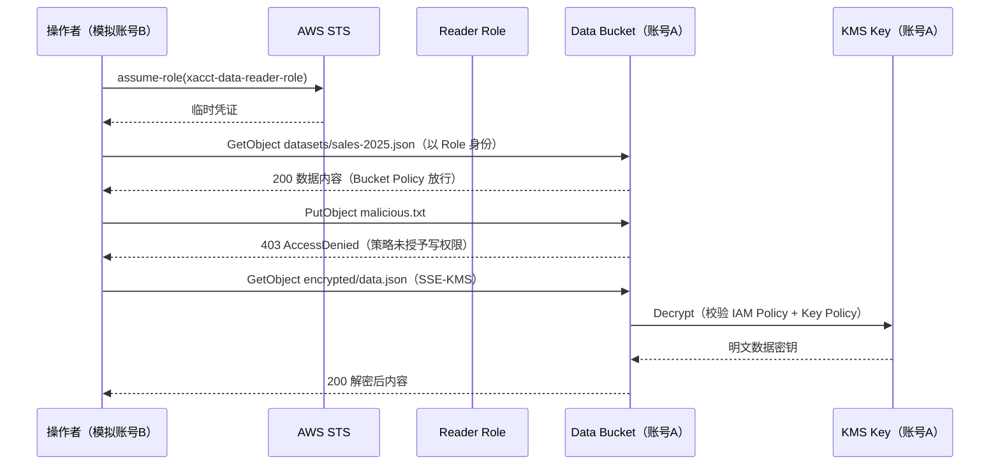
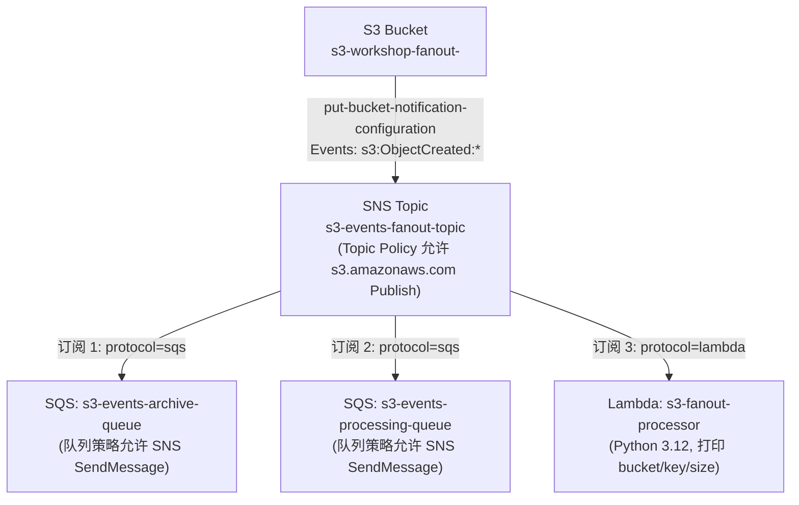
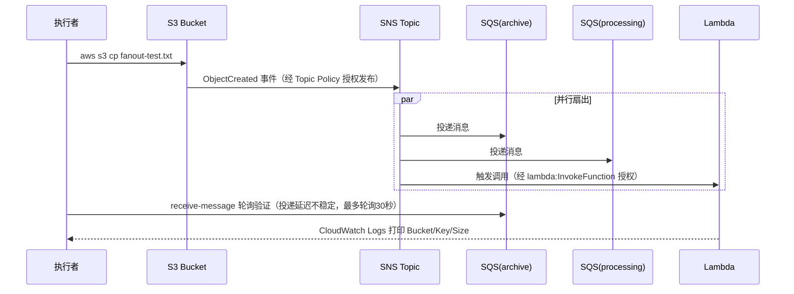
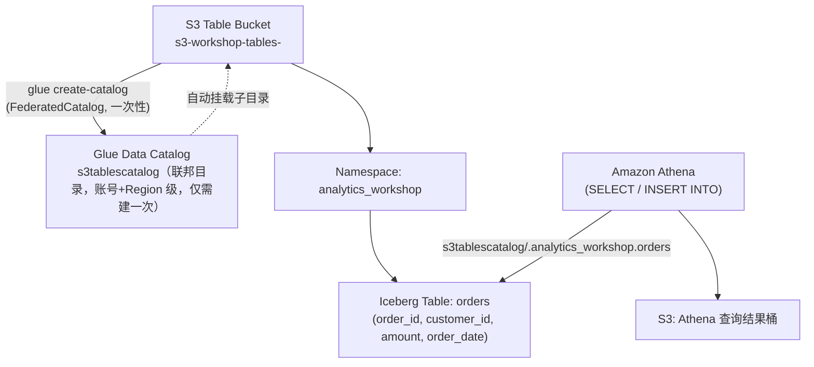
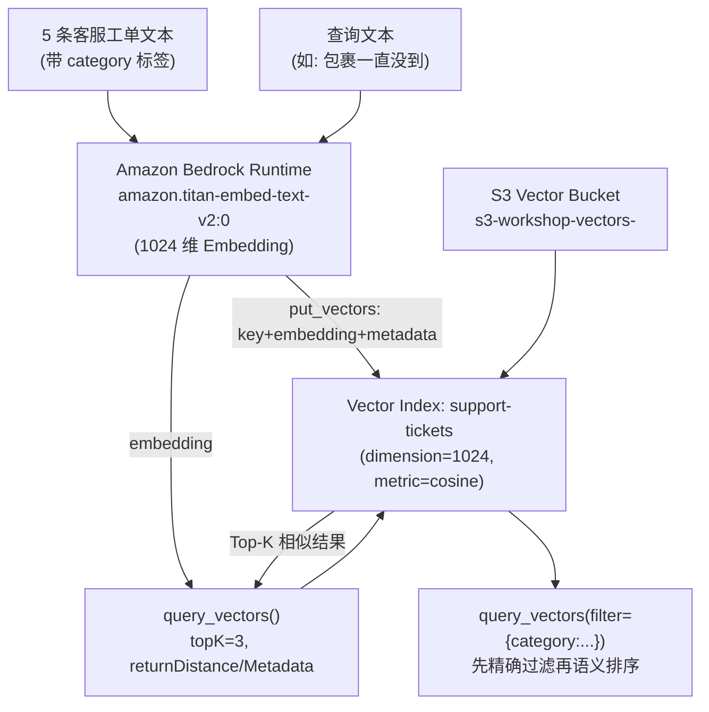

# 架构文档

本仓库包含 20 个 Demo，这里不做全量架构图汇总，只对其中组件交互较复杂、值得可视化的 Demo 提供架构图；其余 Demo 请直接看对应的 `docs/demoXX-*.md`。

以下 6 个 Demo 涉及多组件事件链路、跨账号/跨区域架构、治理数据流或生成式 AI 集成，复杂度明显高于其余以"配置单个桶属性 + 验证"为主的 Demo，因此单独画图：

- **Demo05 — CRR/SRR 跨区域复制**：双区域双桶 + 专属 IAM 角色的异步复制链路
- **Demo07 — Inventory + Batch Operations**：清单生成与批量执行两阶段治理闭环
- **Demo11 — 跨账号访问**：Bucket Policy / Assume Role 两种模式 + KMS 双重授权
- **Demo16 — SNS+SQS 扇出架构**：S3 事件广播给 SNS，再并行分发给多个 SQS 队列与 Lambda，多消费者解耦链路
- **Demo18 — S3 Tables（Apache Iceberg）**：Table Bucket + Glue 联邦目录集成 + Athena 查询/写入的数据湖仓链路
- **Demo19 — S3 Vectors**：Bedrock Titan Embeddings 生成向量 + S3 Vectors 存储与相似度检索的语义检索链路

---

## Demo05 — 跨区域复制（CRR）与同区域复制（SRR）

源桶（us-east-1）与目标桶（us-west-2）都必须开启版本控制，这是复制的硬前提。专属 IAM 角色（信任 `s3.amazonaws.com`）负责读取源桶对象版本并写入目标桶，复制规则可按前缀过滤、指定目标存储类（此处降级为 STANDARD_IA 省成本）、并同步删除标记。复制是异步的，通过 `ReplicationStatus` 字段追踪进度。

---

## Demo07 — S3 Inventory 与 Batch Operations：清单驱动的批量对象操作

Inventory 确定操作范围，Batch Operations 批量执行——两者是天然搭档。源桶配置两条 Inventory 规则（每日全量 CSV + 每周 Parquet），清单写入目标桶（Bucket Policy 用 `ArnLike SourceArn` 限定只信任特定源桶）。真实生产中 Batch Operations 的 Manifest 直接引用 Inventory 产出的 `manifest.json`；Batch Operations 专属 IAM 角色（信任 `batchoperations.s3.amazonaws.com`）读取清单、对源桶对象执行标签更新等操作，任务状态经历 `New → Preparing → Ready(需人工确认) → Active → Complete`，完成报告写回目标桶。

---

## Demo11 — 跨账号 S3 访问：多账号架构权限模式

企业多账号架构中最常见的两种跨账号访问模式：**Bucket Policy 直接授权**（适合只读、无需 Assume Role）和 **Assume Role**（适合精细权限 + 审计追踪）。当数据桶启用 KMS 加密时，跨账号访问需要 Bucket Policy 与 KMS Key Policy **两层授权同时到位**，缺一即报 `AccessDenied`。

---

## Demo16 — S3 事件通知扇出：SNS + SQS + Lambda 解耦架构

Demo14 是 S3 → Lambda 的直连架构，新增消费者需要改 S3 通知配置；本 Demo 把 S3 事件先广播到 SNS Topic，再由 SNS 并行分发给两个 SQS 队列（模拟归档、处理两个下游系统）和一个 Lambda，三个消费者各自独立订阅、独立扩展、互不影响。

---

## Demo18 — S3 Tables：原生 Apache Iceberg 表存储

Table Bucket 是一种新的桶类型，原生理解 Iceberg 表语义。用 CLI 创建 Table Bucket 后需要额外执行一次账号+Region 级的 `glue create-catalog`，把 Table Bucket 挂载到 `s3tablescatalog` 联邦目录下，Athena 才能发现并查询/写入其中的表。

---

## Demo19 — S3 Vectors：原生向量存储与语义检索

Vector Bucket 是原生支持向量嵌入存储与查询的新桶类型。用 Bedrock Titan Text Embeddings V2 把客服工单文本转成 1024 维向量并写入 S3 Vectors 索引，之后既可以做纯语义相似度检索，也可以叠加 Metadata 过滤（如按 `category` 精确过滤后再排序）。

